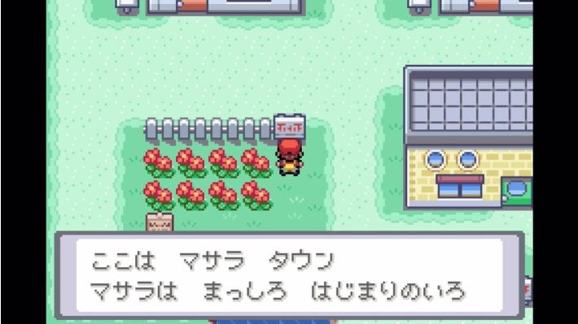
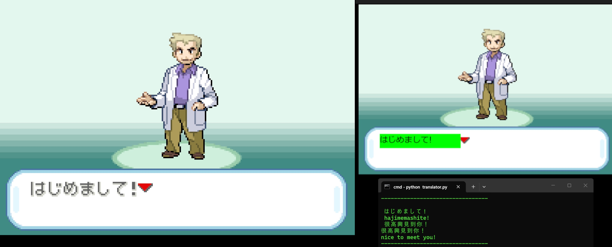
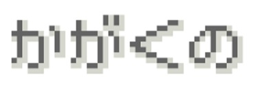
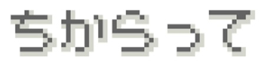

# game-screen-text-translator

## 1. About
I have a thought of learning Japanese through game before. The game that I tried was Pokemon, but I gave up after I had played for a while because it is hard to type in each character manually and translate them into either English or Chinese. Recently, Nintendo has released Pokemon FireRed/LeafGreen on Switch. It only has English and Japanese version, so I am thinking if there is a way to runtime detect the Japanese words on the screen (I am using capture card to project switch screen on my computer).

### Program Flow
This translator is mainly based on an open source project called EasyOCR developed by Jaided AI. It can be used to extract detected words from the image. Thus the program flow looks like this:
1. WindwosCapture captures switch gameplay screen of from OBS.
2. Crop the image to remove unnecessary part.
3. EasyOCR extracts text from the captured image.
4. GoogleTranslator translates the text. Also convert those text into Romaji format based on a pre-defined romaji csv.
5. Print the result.

### Training
The OCR result did't look good when I used japanese_g2.pth model downloaded from https://www.jaided.ai/easyocr/modelhub/. It is expected because the pre-trained model may not be trained with the font that used in this kind of old Pokemon game.

I included the trainer program from EasyOCR https://github.com/JaidedAI/EasyOCR and made some modifications on it. I trained the japanese_g2.pth model with Pokemon japanese text image and the result looks much better.

### Demo


## 2. How to run
Ensure **window_title** and **font_path_example** are correct in translator.py. I am using GC573 as my capture card and OBS so my windows_title is "Projector - Source: GC573". The default japanese font path on Windows should be "C:/Windows/Fonts/meiryo.ttc"
```
pip install easyocr deep_translator
python translator.py
```

## 3. How to fine-tune current model
Prepare all training data images, labels.csv in all_data/[folder name defined in select_data of config.yaml] and images, labels.csv in all_data/validation. Data in validation folder is used to test the fine-tuned model.

For example:

#### 1.jpg

#### 2.jpg


#### labels.csv
```
filename,words
1.jpg,かがくの
2.jpg,ちからって
```

Also, define the file path of the model that you want to fine tune in **saved_model** of config.yml. Once Ready, run
```
python trainer.py
```